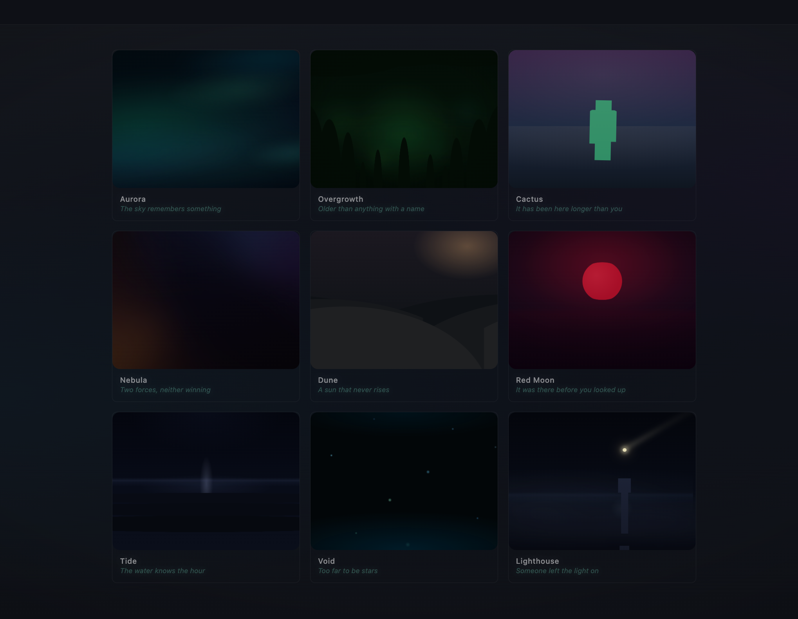

  
  
  
  # Nocturne
  
  Small visual experiments built with React and SCSS.
  
  
  

Each experiment focuses on a single feeling or place — distant lights, slow movement, and environments that feel somewhere between real and imagined. Pieces like *Aurora*, *Lighthouse*, and *Void* are named more like memories than components.

The titles aren't descriptions — they're closer to the feeling each piece tries to capture.

  

  

    <strong>How it works</strong>
  

 

Each experiment is a single React component with all motion handled entirely through CSS.

Layered radial gradients, long-duration keyframe animations, blur, and blend modes create the movement and depth. Most pieces use only two pseudo-elements moving at different speeds and directions to create the illusion of space without adding extra DOM elements.

No canvas. No WebGL. No animation libraries. Just CSS doing more than it's usually asked to.

